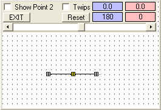



## A Graphics Pixels plus Angles\_update

### Description

This is the basic concept of an idea I've had for awhile.Maybe someone will take it to the next level if there's any interest.Don't know how practical it is, but I do not intend to go any further with it. Enjoy.Added: Holding Shift plus arrow keys will move points as a group.
 
### More Info
 

             |
---                |---
**Submitted On**   |2009-02-12 17:30:54
**By**             |[Kenneth Foster](https://github.com/Planet-Source-Code/PSCIndex/blob/master/ByAuthor/kenneth-foster.md)
**Level**          |Intermediate
**User Rating**    |5.0 (45 globes from 9 users)
**Compatibility**  |VB 6\.0
**Category**       |[Graphics](https://github.com/Planet-Source-Code/PSCIndex/blob/master/ByCategory/graphics__1-46.md)
**World**          |[Visual Basic](https://github.com/Planet-Source-Code/PSCIndex/blob/master/ByWorld/visual-basic.md)
**Archive File**   |[A\_Graphics2143592122009\.zip](https://github.com/Planet-Source-Code/kenneth-foster-a-graphics-pixels-plus-angles-update__1-71712/archive/master.zip)

